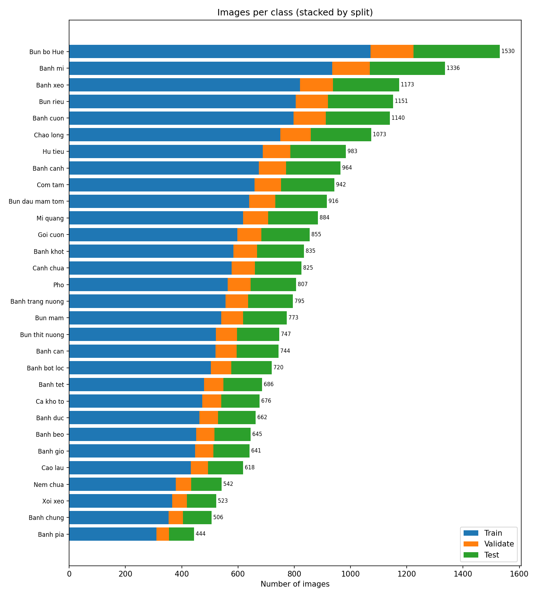
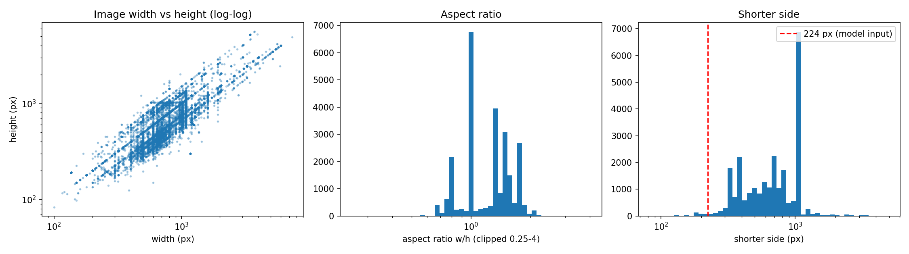
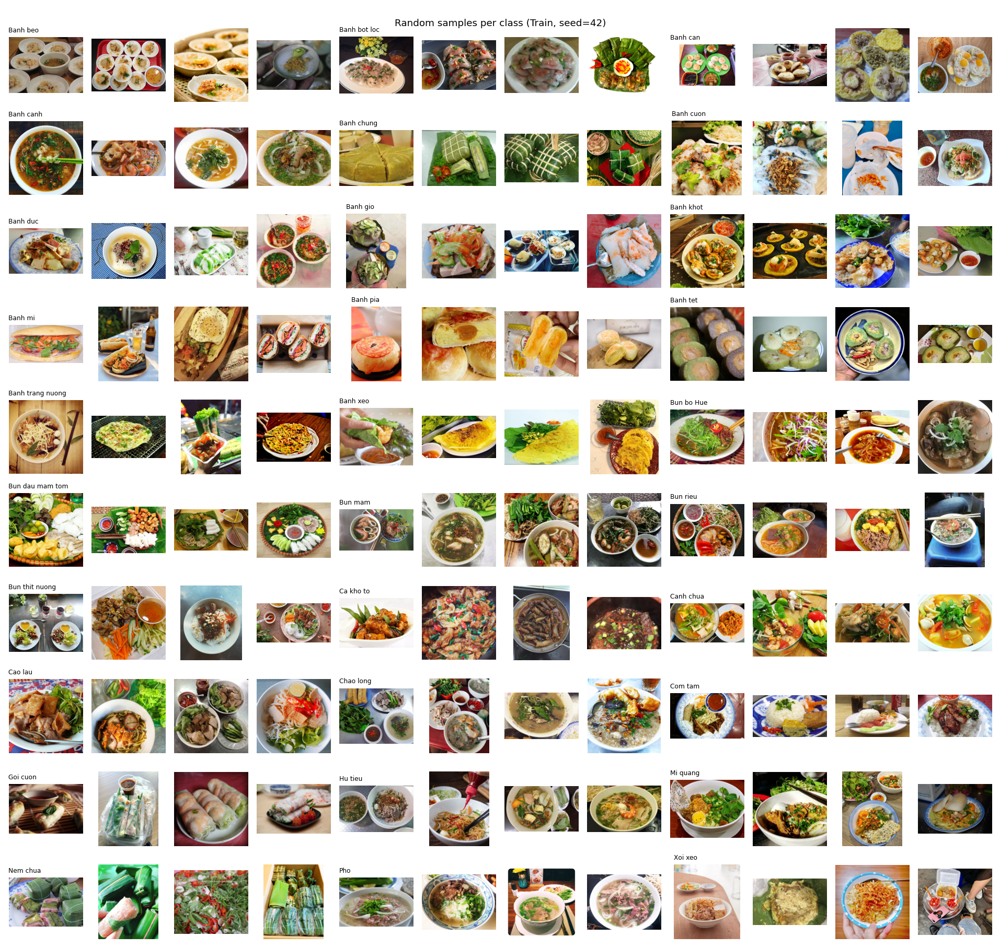
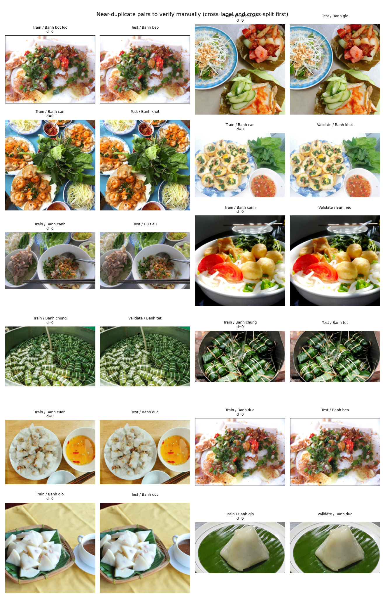

# A2 Dataset EDA - summary

- Generated: 2026-10-07 20:22:04 +0700 by `scripts/a2_eda.py` (seed 42)
- Root: `D:\course_hcmut\hk261\Deep Learning and Its Applications\Assignment\data\30VNFoods\Images`
- Dataset fingerprint (sha256 over sorted `relpath:md5`): `fa49ef9e176949df8d42b14ee1e870501f4dd31765be27bf15828591e1ff0a41`
- Image files: **25136** (readable 25136, corrupted 0); non-image files ignored: 0
- Classes: **30**

## Split overview

| split | role | images | classes | min/class | min class | max/class | max class | mean/class | imbalance (max/min) |
|---|---|---|---|---|---|---|---|---|---|
| Train | train | 17581 | 30 | 310 | Banh pia | 1071 | Bun bo Hue | 586.0 | 3.45 |
| Validate | val | 2515 | 30 | 45 | Banh pia | 153 | Bun bo Hue | 83.8 | 3.4 |
| Test | test | 5040 | 30 | 89 | Banh pia | 306 | Bun bo Hue | 168.0 | 3.44 |

## Images per class

| class | Train | Validate | Test | total |
|---|---|---|---|---|
| Bun bo Hue | 1071 | 153 | 306 | 1530 |
| Banh mi | 935 | 133 | 268 | 1336 |
| Banh xeo | 821 | 117 | 235 | 1173 |
| Bun rieu | 805 | 115 | 231 | 1151 |
| Banh cuon | 798 | 114 | 228 | 1140 |
| Chao long | 751 | 107 | 215 | 1073 |
| Hu tieu | 688 | 98 | 197 | 983 |
| Banh canh | 674 | 97 | 193 | 964 |
| Com tam | 659 | 94 | 189 | 942 |
| Bun dau mam tom | 640 | 92 | 184 | 916 |
| Mi quang | 618 | 89 | 177 | 884 |
| Goi cuon | 598 | 85 | 172 | 855 |
| Banh khot | 584 | 84 | 167 | 835 |
| Canh chua | 577 | 83 | 165 | 825 |
| Pho | 564 | 81 | 162 | 807 |
| Banh trang nuong | 556 | 80 | 159 | 795 |
| Bun mam | 541 | 77 | 155 | 773 |
| Bun thit nuong | 522 | 75 | 150 | 747 |
| Banh can | 520 | 75 | 149 | 744 |
| Banh bot loc | 503 | 73 | 144 | 720 |
| Banh tet | 480 | 68 | 138 | 686 |
| Ca kho to | 473 | 67 | 136 | 676 |
| Banh duc | 463 | 66 | 133 | 662 |
| Banh beo | 451 | 65 | 129 | 645 |
| Banh gio | 448 | 64 | 129 | 641 |
| Cao lau | 432 | 62 | 124 | 618 |
| Nem chua | 379 | 54 | 109 | 542 |
| Xoi xeo | 366 | 52 | 105 | 523 |
| Banh chung | 354 | 50 | 102 | 506 |
| Banh pia | 310 | 45 | 89 | 444 |

## Image size and format

- Width: min 100, median 1000, max 7360 px
- Height: min 83, median 720, max 5616 px
- Shorter side < 224 px: 1.38% (< 128 px: 0.04%)
- Median aspect ratio (w/h): 1.333; outside [0.5, 2]: 1.11%
- Total size on disk: 4296.5 MB; median file 123.7 KB
- Formats: {'JPEG': 25007, 'PNG': 120, 'BMP': 2, 'MPO': 7}
- Colour modes: {'RGB': 25136}

## Duplicates and leakage

- Exact byte-identical groups (MD5): 63
- Near-duplicates: 64-bit perceptual hash (pHash), Hamming distance threshold sensitivity:

| threshold | pairs | same split+label | cross-split | cross-label |
|---|---|---|---|---|
| 0 | 229 | 84 | 121 | 60 |
| 2 | 283 | 108 | 149 | 62 |
| 4 | 337 | 140 | 171 | 64 |
| 6 | 403 | 173 | 203 | 65 |
| 8 | 490 | 208 | 249 | 83 |
| 10 | 757 | 245 | 374 | 272 |

At threshold **4** (single-linkage clusters): 309 clusters covering 632 images (largest 3); cross-split clusters: **159**; cross-label clusters: **55**.

Removal rules: corrupted files dropped; clusters with >1 label dropped entirely (label noise); cross-split clusters keep only the copy in the most protected split (test > val > train); within-split copies are optional dedup.

| reason | action | images |
|---|---|---|
| cross_label_duplicate | drop | 116 |
| leak_copy_of_Test | drop | 92 |
| leak_copy_of_Validate | drop | 38 |
| within_split_duplicate | optional | 132 |

### Split sizes after required removals

| split | files | drop (required) | after drop | optional dedup |
|---|---|---|---|---|
| Train | 17581 | 188 | 17393 | 118 |
| Validate | 2515 | 23 | 2492 | 4 |
| Test | 5040 | 35 | 5005 | 10 |

> pHash can give false positives (e.g. similar plating). Check `figures/duplicate_examples.png` and `near_duplicate_pairs.csv` before finalising the drop list.
